

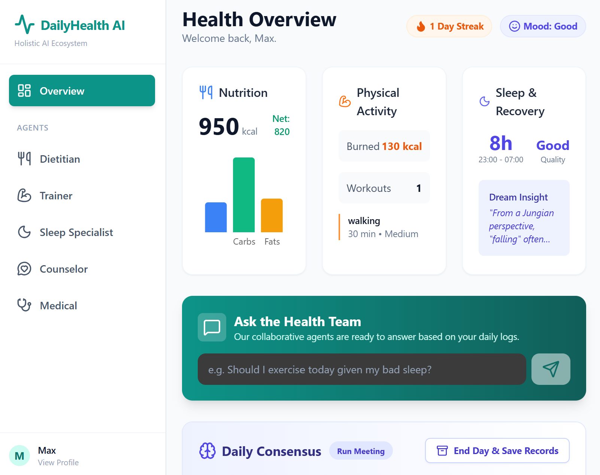

# DailyHealth AI MedGemma
This project is a fork of DailyHealth AI, specialized with **MedGemma** for advanced medical agent reasoning. Specifically, the medical agent ingests complex medical documents (like test results) to update the user's risk profile and answers clinical questions, leveraging the specialized medical knowledge of MedGemma.

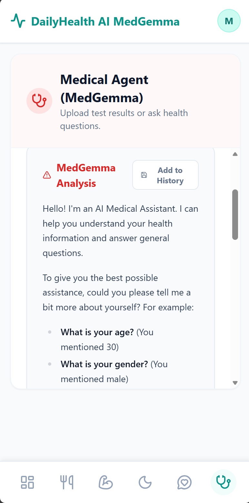

# Problem
The goal of this project is to provide access to personalized health coaching. While modern technology offers endless lifestyle choices, it also contributes to widespread health crises, including poor nutrition, sedentary behavior, and chronic stress. While we visit doctors for acute illnesses, the majority of health outcomes are determined by daily decisions—what we eat, how we move, how we sleep, and how we manage emotion. Furthermore, generic health advice fails to account for individual medical histories and genetic backgrounds. There is a critical need for a system that bridges the gap between clinical medical records and daily lifestyle choices to prevent disease, reduce medical burdens, and improve overall quality of life.

# Solution
Personal health is a multimodal challenge involving distinct, complex domains: nutrition, physiology, sleep science, psychology, and medicine. A single general-purpose AI model often struggles to maintain deep expertise across all these verticals simultaneously. An agentic architecture is the ideal solution because it allows for separation of concerns. We can assign a specialized "Persona" and specific instructions to each domain (e.g., a Jungian analyst for sleep, a clinical thinker for medicine). These agents can operate independently to gather deep data, and then collaborate to form a holistic view of the user, mirroring a real-world board of health experts.

# Architecture
I built DailyHealth AI MedGemma, a comprehensive health ecosystem powered by the Google Gemini API and specialized Gemma models. The architecture utilizes a Multi-Agent System consisting of five specialists: a Dietitian, Trainer, Sleep Specialist, Counselor, and **MedGemma Medical Specialist**. These agents operate sequentially throughout the day to ingest multimodal user data (images, text, metrics). At the end of the day, a Lead Coordinator Agent aggregates these distinct logs, retrieves long-term context (medical history), and synthesizes a "Daily Board Meeting" report. This generates a cohesive strategy for the user's next day, ensuring that advice from one domain (e.g., exercise) is safe given the context of another (e.g., medical conditions).

The project implements key concepts of AI agents:

* **Multi-Agent System**: Five distinct personas powered by Gemini 3 and MedGemma models work in parallel to gather data, with a sequential Coordinator agent handling synthesis. 
* **Sessions & Memory**: I implemented a robust state management system where static context (medical history) and episodic memory (daily summaries) are persisted and retrieved to ground agent responses.
* **Context Engineering**: To manage context window limits, daily detailed logs are "compacted" into executive summaries before being stored in long-term memory.

# Set up

### Run app in Google AI Studio:
https://ai.studio/apps/drive/1cKOVrcPRArWwCj1XXFs6Tg1zYPtsh3p7?fullscreenApplet=true

However, this does not support MedGemma and instead uses Gemini 3.1 pro for the medical agent. To use MedGemma, deploy it locally or on Google Cloud and provide the link as below. 

### Run Locally:

**Prerequisites:**  Node.js

1. Install dependencies:
   `npm install`
2. Set the `GEMINI_API_KEY` in [.env.local](.env.local) to your Gemini API key
3. Set the `MEDGEMMA_API_URL` in [.env.local](.env.local) to your MedGemma API link
4. Run the app:
   `npm run dev`

# Instruction

### Demo in YouTube video: 
https://www.youtube.com/shorts/yDilStyoBCM

### Demo in images:

**Authentication & Privacy:** Secure login ensures sensitive health data remains private.

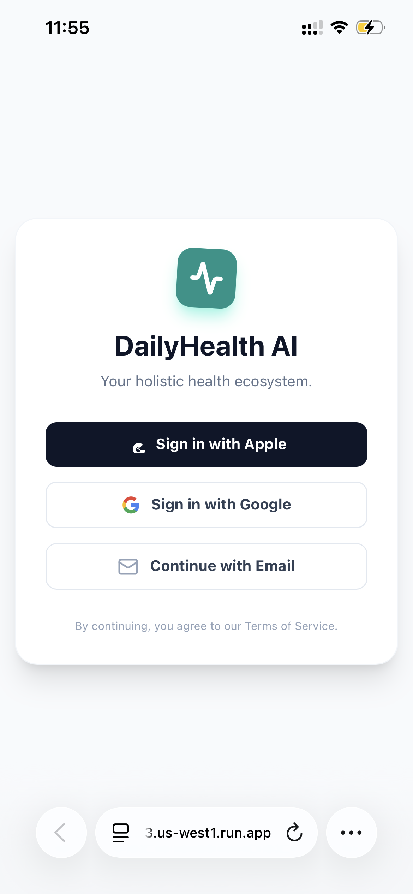

**Onboarding:** The system establishes a baseline by capturing demographics and goals, which initiates the long-term memory context.

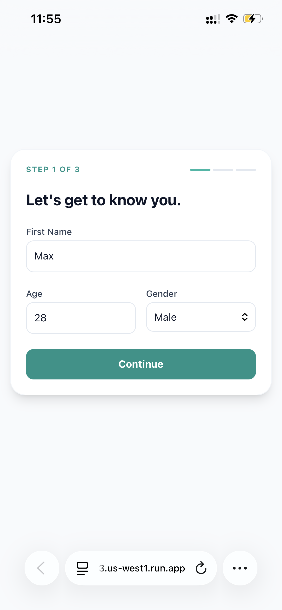
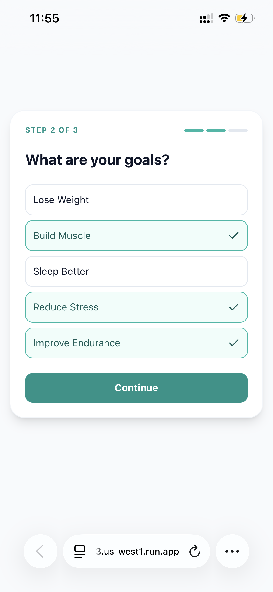
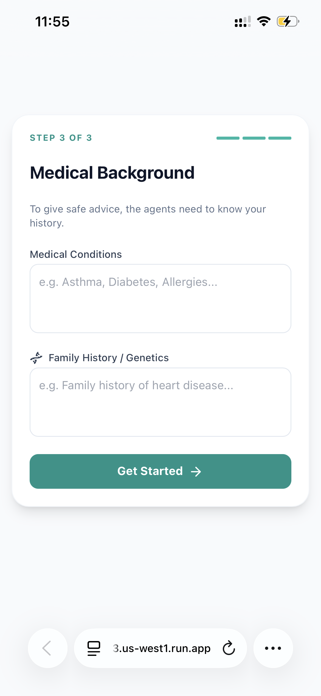

**Dietitian Agent:** Utilizing Gemini’s vision capabilities, this agent analyzes food photos to extract calories and macros, updating the user’s nutritional profile instantly.

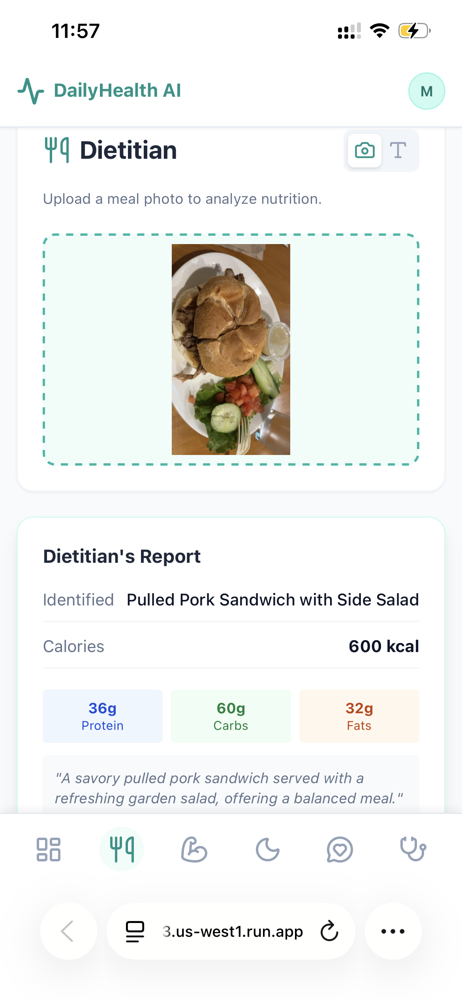

**Trainer Agent:** This agent designs bespoke workouts based on real-time variables (energy levels, time constraints) and cross-references them with medical safety protocols.

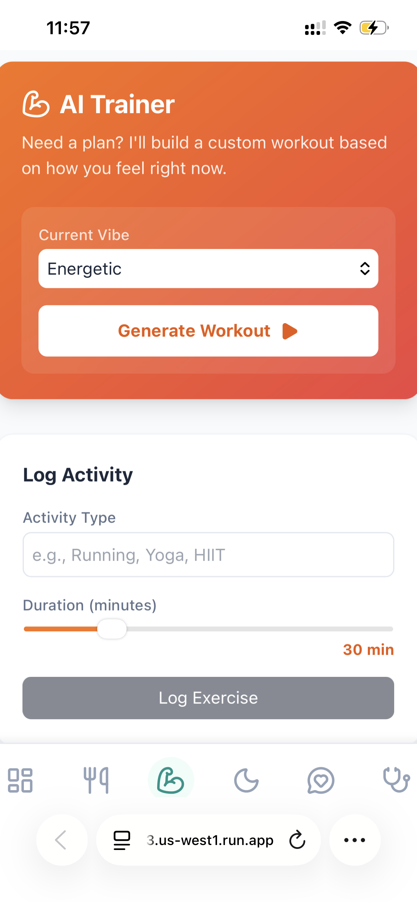

**Sleep Specialist:** Beyond tracking duration, this agent performs qualitative analysis, including Jungian dream interpretation.

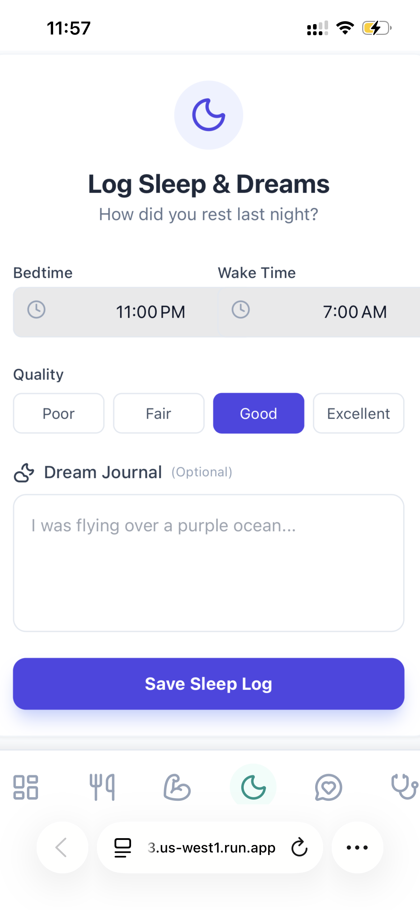

**Counselor Agent:** A dedicated mental health support interface that tracks emotional valence and provides empathetic dialogue.

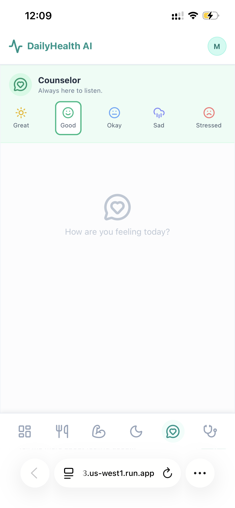
   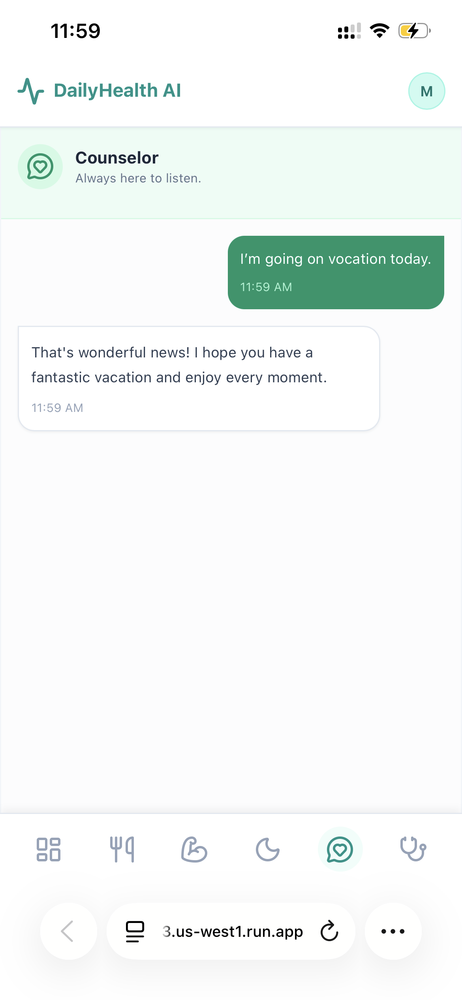

**Medical Specialist:** This agent ingests complex medical documents (like test results) to update the user's risk profile and answers clinical questions.

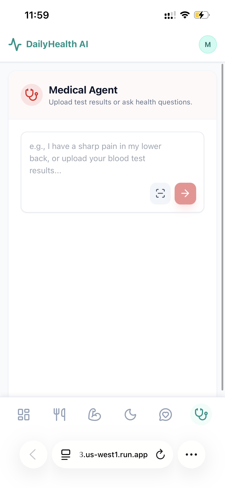

**The Consensus Meeting:** The core feature where the Coordinator Agent leads a synthesis of all data streams, producing a strategic executive summary.

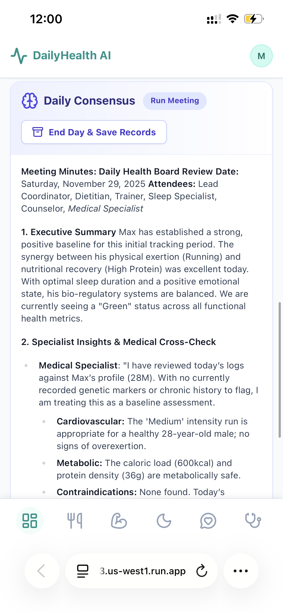
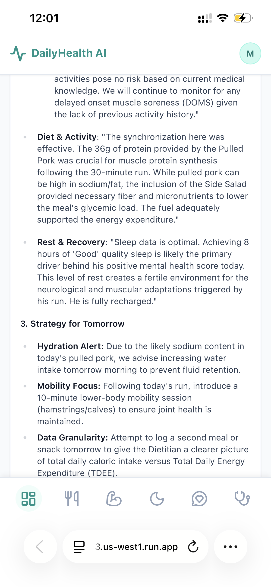

**Archival Memory:** Daily summaries are compressed and archived, allowing the system to detect long-term trends.

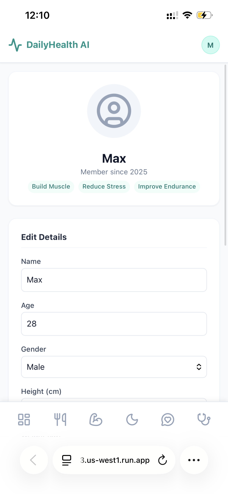
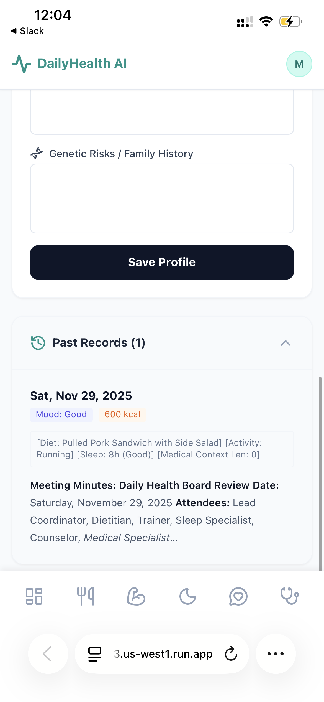

# Future work
* Tool Integration: Currently, the agents rely on LLM knowledge. I would integrate Model Context Protocol (MCP) to connect specialized tools to increase accuracy, such as Apple Health for biometric data, Apple Fitness for exercises, and Cal AI for exact calorie counting.
* Agent-to-Agent (A2A) Protocol: I would implement a chat loop where agents can debate. For example, the Trainer could propose a workout, and the Medical Agent could veto it based on a new symptom, requiring the Trainer to regenerate the plan before presenting it to the user.
* Evaluation Framework: I would implement automated eval sets to ensure that advice remains medically safe and consistent with the user's history over long periods.
* Multimodal inputs: Standard medgemma-1.5-4b-it is a text-in/text-out model. To process images on Kaggle, I use a separate vision model in the pipeline to extract the text from the medical document before passing it to MedGemma. However, a multimodal medical variant could be used.
